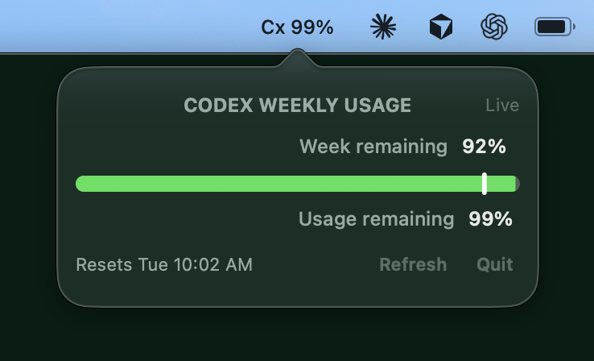
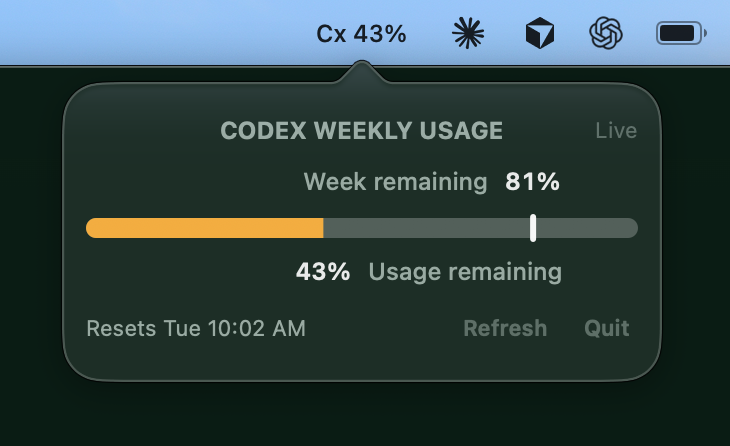
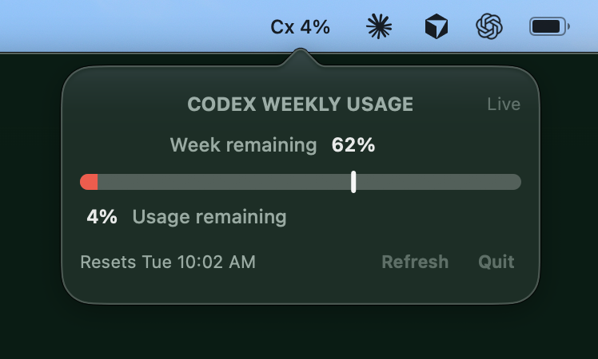

# Codex Usage Micro

**A tiny macOS menu-bar meter for Codex usage.**

See how much weekly usage is left—and how much time remains in the limit window—without keeping a terminal open.

<p align="center">
  
  
  
</p>

The colored bar is your **usage remaining**. The white marker is your **week remaining**. Green means usage is ahead of the clock, orange means it is behind, and red means less than 15% remains.

## Requirements

- macOS 13 or newer
- Apple silicon
- Xcode command line tools
- The ChatGPT desktop app or an authenticated Codex CLI

## Build and run

```sh
git clone https://github.com/scottdflorida/codex-usage-micro.git
cd codex-usage-micro
./build.sh
open "build/Codex Usage Micro.app"
```

No API key, server, database, package manager, or external dependency is required. The app launches the local Codex app server, reads the weekly rate-limit response, and refreshes every five minutes. It sends no telemetry of its own.

To change the automatic refresh cadence, edit [`Sources/RefreshConfiguration.swift`](Sources/RefreshConfiguration.swift) and rebuild.

## License

[MIT](LICENSE)

Codex Usage Micro is an unofficial utility and is not affiliated with OpenAI.
